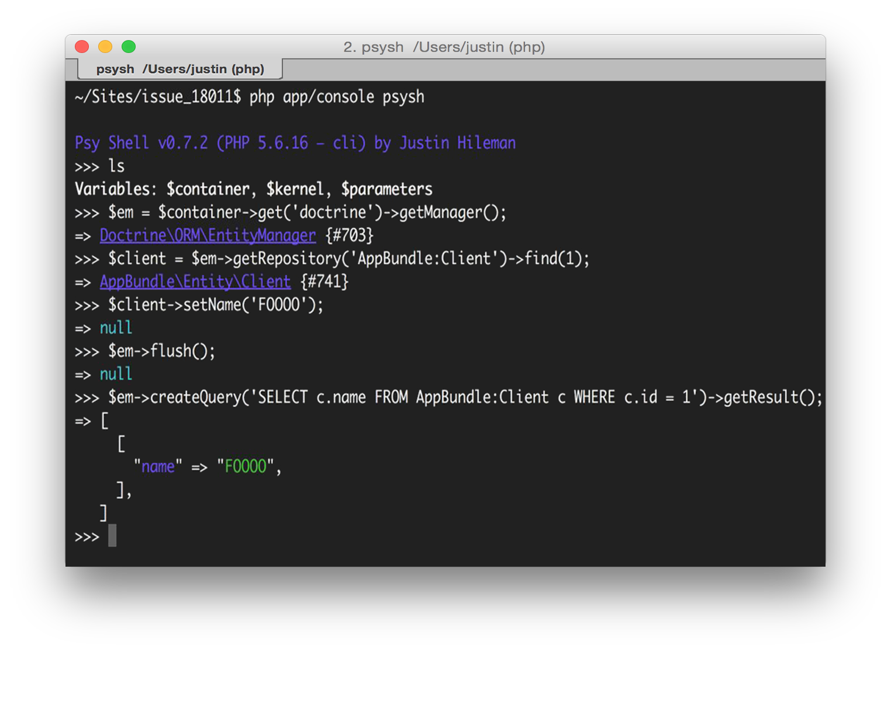

# PsyshBundle

[](https://packagist.org/packages/theofidry/psysh-bundle)
[](https://travis-ci.org/theofidry/PsyshBundle?branch=master)
[](https://scrutinizer-ci.com/g/theofidry/PsyshBundle/?branch=master)
[](LICENSE)

A bundle to use the php REPL [PsySH][1] with [Symfony][2]. Learn more at [psysh.org][1] and check out the [Interactive Debugging in PHP talk from OSCON](https://presentate.com/bobthecow/talks/php-for-pirates) on Presentate.

What does it do exactly?
* Loads [PsySH][1] with the application dependencies
* Gives access to the following variables:

| Variable              | Description                          |
|-----------------------|--------------------------------------|
| `$container`          | Instance of Symfony ServiceContainer |
| `$kernel`             | Instance of Symfony Kernel           |
| `$parameters`         | Instance of Symfony parameters       |

Aside from that it's the plain old [PsySH][1]! You can also [customize it](#customize-psysh) to add your own variables.


## Documentation

1. [Install](#install)
1. [Usage](#usage)
    1. [PsySH as a debugger](doc/debugger.md)
    1. [Reflect like a boss](doc/reflect.md)
    1. [PsySH for breakpoints](doc/breakpoint.md)
1. [Customize PsySH](#customize-psysh)
1. [Credits](#credits)


## Install

You can use [Composer](https://getcomposer.org/) to install the bundle to your project:

```bash
composer require --dev theofidry/psysh-bundle
```

Then, enable the bundle by updating your `app/AppKernel.php` file to enable the bundle:  
(not needed on symfony 5, bundle is automaticaly registred in `config/bundles.php`)
```php
<?php
// app/AppKernel.php

public function registerBundles()
{
    //...

    if (in_array($this->getEnvironment(), ['dev', 'test'])) {
        //...
        $bundles[] = new Fidry\PsyshBundle\PsyshBundle();
    }

    return $bundles;
}
```

## Usage

```bash
# Symfony > 4.0
bin/console psysh
```

or

```php
use function psysh

class X
{
    function foo()
    {
        psysh(get_defined_vars(), $this);   // Debug with the current context
    }
}
```



[Go further](#documentation).


## Customize PsySH

### Adding a custom command
Adding a custom command for PsySH is as simple as defining a service with `psysh.command` tag!

```yaml
services:
    my_psysh_command:
        class: Acme\Shell\MyCommand
        tags:
            - { name: psysh.command }
```

Or even simpler if you use Symfony 3.3+:

```yaml
services:
    _defaults:
        autoconfigure: true
        autowire: true
        public: false

    Acme\Shell\MyCommand: ~
```

> PsyshBundle provides autoconfiguration for custom Psysh command services, as long as they inherit from
> `Psy\Command\ReflectingCommand` or `Psy\Command\Command`.

### Adding custom variables
It is possible to add custom variables to the shell via configuration.
Variables can be of any type, container parameters references (e.g. `%kernel.debug%`) or even services
(prefixed with `@`, e.g. `"@my_service"`).

```yaml
# app/config/config_dev.yml

psysh:
    variables:
        foo: bar
        router: "@router"
        some: [thing, else]
        debug: "%kernel.debug%"
```

Now if you run `php app/console psysh` and then `ls`, you will see the variables `$foo`, `$router`, `$some` and `$debug`,
in addition to already defined variables:

```
>>> ls
Variables: $foo, $router, $some, $debug...
```

Default variables are:
- `$container` (the service container)
- `$kernel`
- `$parameters` (all container parameters)
- `$self` (the PsySH shell itself)


## Credits

This bundle is developed by [Théo FIDRY](https://github.com/theofidry). This project has been made possible thanks to:

* [Justin Hileman](https://github.com/bobthecow): author of [PsySH][1] and [all the contributors of the PsySH project](https://github.com/bobthecow/psysh/graphs/contributors)
* [Adrian Palmer](https://github.com/navitronic): gave the lead for porting [PsySH][1] on [Symfony][2]


[1]: https://psysh.org/
[2]: https://symfony.com/
