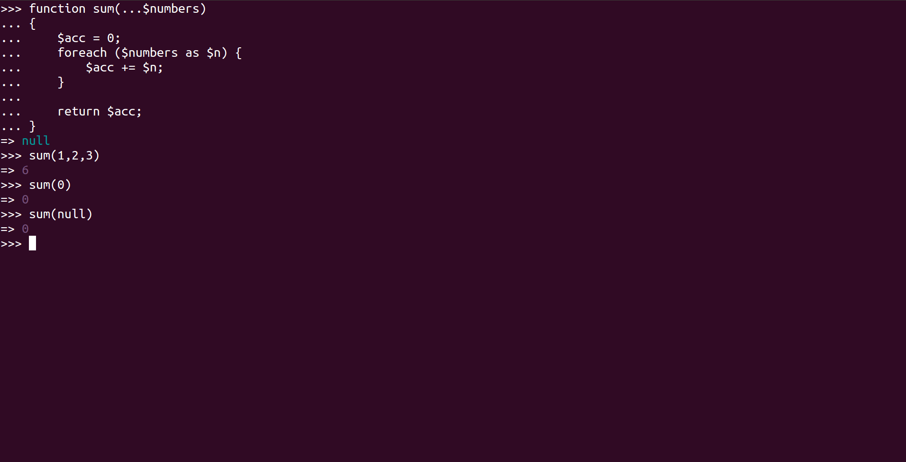

# PsySH as a debugger

Note: most of the following use cases are perfectly valid outside outside of Symfony context.


## Test a function

We have the following [variadic function](http://php.net/manual/en/functions.arguments.php#functions.variable-arg-list.new) we wish to test:

```php
function sum(...$numbers)
{
    $acc = 0;
    foreach ($numbers as $n) {
        $acc += $n;
    }

    return $acc;
}
```

To do so, launch a PsySH shell, declare the function and use it as you like:




## Handle namespaces

By default, you are at the root namespace. To go to a specific namespace. To go between namespaces, just use the `namespace` command:

```bash
>>> namespace MyNamespace
=> null

# From now on we are in the `MyNamespace` namespace
# Example: if we declare a function which prints the namespace:
>>> function f() { return __NAMESPACE__."\n";}
=> null
# When we call it, it will display `"MyNamespace"`
>>> f()
=> "MyNamespace"

# To go back to the root namespace, use:
>>> namespace {}
=> null
# Now we are at the root, if you try to call again `f()` you'll get an error:
>>> f()
PHP Fatal error:  Call to undefined function f() in eval()'d code on line 1

# If you wish to call it, you have to use its fully qualified name:
>>> MyNamespace\f()
=> "MyNamespace"
```


## Load files

Although it's convenient, if your function is false and you want to correct something, it's a pain to always redeclare
it. So another way is to declare your function in a `.php` file and load this file instead!


```php
<?php

// test.php

function sum(...$numbers)
{
    $acc = 0;
    foreach ($numbers as $n) {
        $acc += $n;
    }

    return $acc;
}
```

```bash
>>> require('test.php')
=> 1 # Return value is 1 when no problem occur
>>> sum()
0
=> null
```

Note that the require is relative from *where* you launch the PsySH instance. Example if I go to the `vendor` folder, I
have to take into consideration the path:

```bash
$ php ../app/console psysh
>>> require('../test.php')
=> 1
```


## Autoloading

With the example we loaded a function from it's file. But what if we want to load it from its fully qualified name? It
does not matter as long as the function is loaded in the PsySH shell context. For instance, since the PsySH shell is
loaded with the application autoloader, the following works:

```bash
>>> $kernel = new AppKernel('dev', true)   # create a Kernel instance
>>> $appBundle = new AppBundle\AppBundle() # create an instance of the AppBundle
```

If the class or function you want to use is not present in the shell context, you have to require it beforehand with 
the `require` command.


## Handle dependency injections

Now you have seen the basics. But I see you coming saying that the examples above are easy, but how we deal with a
function or a class which needs services? The long and cumbersome way is to instantiate them one by one to finally
get what you want.

Hopefully, PsySH is already loaded with Symfony's context. As shown bellow, you have access to the `$container`,
`$kernel` and `$parameters` out of the box. As a result, you can easily retrieve any service or parameter!


Previous chapter: [Install](install.md)<br />
Next chapter: [Reflect like a boss](reflect.md)
