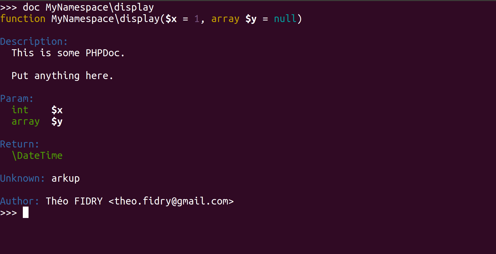
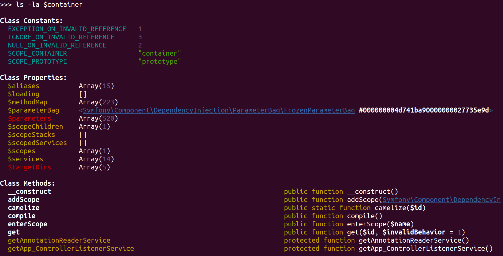

# Documentation & Reflection


## Read documentation

You can easily read the documentation from any class or function.

Let's take for instance the following function:

```php
<?php

// test.php

namespace DummyNamespace;

/**
 * This is some PHPDoc.
 *
 * Put anything here.
 *
 * @unknownMarkup
 *
 * @param int   $x
 * @param array $y
 *
 * @return \DateTime
 *
 * @author Théo FIDRY <theo.fidry@gmail.com>
 */
function display($x = 1, array $y = null)
{
}
```

The `doc` command easily show the documentation for the `DummyNamespace\display()` function:



You can also display the doc of PHP functions, example: `doc array_map`


## Reflect like a boss

Reflect thanks to the `ls -la` function:




## View source code

Show the source code of a function with the `show` command:


Previous chapter: [PsySH as a debugger](debugger.md)<br />
Next chapter: [PsySH for breakpoints](breakpoint.md)
